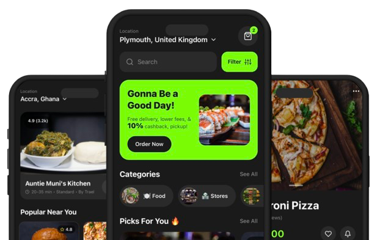

# Trael Delivers - Landing Page

<p align="center">
  
</p>

<p align="center">
  <strong>Ghana's #1 Food Delivery App</strong><br>
  A modern, responsive landing page built with Next.js 14, TypeScript, and Tailwind CSS
</p>

<p align="center">
  <a href="#features">Features</a> •
  <a href="#tech-stack">Tech Stack</a> •
  <a href="#getting-started">Getting Started</a> •
  <a href="#deployment">Deployment</a>
</p>

---

## ✨ Features

- **🎨 Modern UI/UX** - Clean design with smooth hover animations and transitions
- **📱 Fully Responsive** - Optimized for mobile, tablet, and desktop devices
- **🌙 Dark Green Theme** - Consistent branding matching the Trael mobile app
- **⚡ Fast Performance** - Built with Next.js App Router for optimal loading speeds
- **🔍 SEO Optimized** - Meta tags, semantic HTML, and structured data
- **♿ Accessible** - WCAG compliant components and keyboard navigation
- **🇬🇭 Localized** - Tailored for the Ghanaian market

## 🖥️ Screenshots

| Desktop | Mobile |
|---------|--------|
|  | Mobile responsive design |

## 🛠️ Tech Stack

| Technology | Purpose |
|------------|---------|
| [Next.js 14](https://nextjs.org/) | React framework with App Router |
| [TypeScript](https://www.typescriptlang.org/) | Type-safe JavaScript |
| [Tailwind CSS](https://tailwindcss.com/) | Utility-first CSS framework |
| [ESLint](https://eslint.org/) | Code linting |

## 📁 Project Structure

```
trael-landing/
├── 📂 app/
│   ├── favicon.ico          # Site favicon
│   ├── globals.css          # Global styles & Tailwind imports
│   ├── layout.tsx           # Root layout with metadata
│   └── page.tsx             # Main landing page
│
├── 📂 components/
│   ├── Header.tsx           # Navigation bar with mobile menu
│   ├── Hero.tsx             # Hero section with app preview
│   ├── HowItWorks.tsx       # 3-step process explanation
│   ├── Coverage.tsx         # Coverage map & address checker
│   ├── Deals.tsx            # Current promotions & offers
│   ├── Testimonials.tsx     # Customer reviews carousel
│   ├── Partner.tsx          # Merchant/restaurant signup
│   ├── FAQ.tsx              # Accordion FAQ section
│   ├── DownloadCTA.tsx      # App download call-to-action
│   └── Footer.tsx           # Site footer with links
│
├── 📂 public/
│   ├── 📂 avatars/          # Customer testimonial photos
│   ├── 📂 favicon_io-4/     # Favicon files & PWA manifest
│   ├── hero.png             # App screenshot mockup
│   ├── icon.png             # Trael logo (512x512)
│   └── image.png            # Additional images
│
├── package.json
├── tailwind.config.ts
├── tsconfig.json
└── README.md
```

## 🚀 Getting Started

### Prerequisites

- **Node.js** 18.x or higher
- **npm**, **yarn**, or **pnpm**

### Installation

1. **Clone the repository**
   ```bash
   git clone https://github.com/angeloasante/Trael_delivers_landing.git
   cd Trael_delivers_landing
   ```

2. **Install dependencies**
   ```bash
   npm install
   ```

3. **Start the development server**
   ```bash
   npm run dev
   ```

4. **Open in browser**
   
   Navigate to [http://localhost:3000](http://localhost:3000)

### Available Scripts

| Command | Description |
|---------|-------------|
| `npm run dev` | Start development server |
| `npm run build` | Build for production |
| `npm start` | Start production server |
| `npm run lint` | Run ESLint |

## 🎨 Customization

### Theme Colors

The site uses Tailwind's green color palette:

| Color | Tailwind Class | Hex Code | Usage |
|-------|----------------|----------|-------|
| Primary | `green-500` | `#22c55e` | Buttons, links, accents |
| Light | `green-50` | `#f0fdf4` | Backgrounds |
| Medium | `green-100` | `#dcfce7` | Badges, icons |
| Dark | `green-600` | `#16a34a` | Hover states |
| Background | `gray-900` | `#111827` | Dark sections |

### Adding New Sections

1. Create a new component in `/components/YourSection.tsx`
2. Import and add to `app/page.tsx`:
   ```tsx
   import YourSection from '@/components/YourSection';
   
   // Add in the desired position
   <YourSection />
   ```

### Updating Images

Replace files in `/public`:
- **icon.png** - Logo (recommended: 512x512px PNG)
- **hero.png** - App mockup screenshot
- **avatars/** - Customer photos (square, min 128x128px)

## 🌐 Deployment

### Deploy on Vercel (Recommended)

[](https://vercel.com/new/clone?repository-url=https://github.com/angeloasante/Trael_delivers_landing)

1. Push your code to GitHub
2. Import project in [Vercel](https://vercel.com)
3. Deploy automatically

### Other Platforms

```bash
# Build the project
npm run build

# The output will be in .next folder
# Deploy to any Node.js hosting platform
```

## 🌍 Coverage Areas

| City | Status |
|------|--------|
| Accra | ✅ Available |
| Kumasi | ✅ Available |
| Takoradi | 🔜 Coming 2026 |
| Tamale | 🔜 Coming 2026 |
| Cape Coast | 🔜 Coming 2026 |

## 📱 Mobile App

Download the Trael Delivers app:

<p>
  <a href="https://apps.apple.com/trael">
    
  </a>
  <a href="https://play.google.com/store/apps/details?id=com.trael">
    
  </a>
</p>

## 🤝 Contributing

1. Fork the repository
2. Create a feature branch (`git checkout -b feature/amazing-feature`)
3. Commit changes (`git commit -m 'Add amazing feature'`)
4. Push to branch (`git push origin feature/amazing-feature`)
5. Open a Pull Request

## 📄 License

This project is proprietary software owned by Trael Delivers. All rights reserved.

## 👥 Team

**Trael Delivers**
- Website: [trael-delivers.com](https://trael-delivers.com)
- Developer: Angelo Asante

## 📞 Contact & Support

| Channel | Link |
|---------|------|
| 📧 Email | support@trael-delivers.com |
| 🐦 Twitter | [@TraelDelivers](https://twitter.com/traeldelivers) |
| 📸 Instagram | [@TraelDelivers](https://instagram.com/traeldelivers) |
| 💼 LinkedIn | [Trael Delivers](https://linkedin.com/company/trael-delivers) |

---

<p align="center">
  Made with ❤️ in Ghana 🇬🇭
</p>

<p align="center">
  <sub>© 2026 Trael Delivers. All rights reserved.</sub>
</p>
